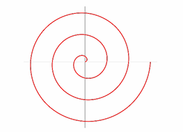

# Questões sobre OpenGL e GLSL

## 1. O que é a GLSL?  
A **GLSL (OpenGL Shading Language)** é a linguagem de programação utilizada para escrever shaders na API OpenGL.  
Ela é fortemente baseada em C, mas adaptada para execução paralela na GPU, permitindo controlar diretamente a forma como os dados gráficos são processados.  

No pipeline programável que trabalhamos em aula, existem dois tipos de **shaders obrigatórios**:  
- **Vertex Shader**: responsável por processar cada vértice, aplicando transformações (ex.: model, view, projection) e passando informações adiante no pipeline.  
- **Fragment Shader**: responsável por processar cada fragmento (pixel candidato), definindo a cor final exibida na tela, incluindo efeitos de iluminação e textura.  

---

## 2. O que são primitivas gráficas?  
Primitivas gráficas são as formas básicas utilizadas para desenhar na tela. Na OpenGL, as principais primitivas são:  
- **Pontos (GL_POINTS)**  
- **Linhas (GL_LINES, GL_LINE_STRIP, etc.)**  
- **Triângulos (GL_TRIANGLES, GL_TRIANGLE_STRIP, etc.)**  

O armazenamento dos vértices na OpenGL é feito em **buffers** na memória da GPU. Especificamente, usamos **Vertex Buffer Objects (VBOs)** para guardar os dados dos vértices (posição, cor, normais, coordenadas de textura, etc.), garantindo eficiência no envio e acesso desses dados durante a renderização.  

---

## 3. VBO, VAO e EBO  

- **VBO (Vertex Buffer Object)**:  
  É o buffer que armazena os dados dos vértices (posições, cores, normais, coordenadas de textura). Ele fica na memória da GPU, tornando o acesso muito rápido durante a renderização.  

- **VAO (Vertex Array Object)**:  
  É um objeto que armazena o **estado da configuração de atributos de vértices**. Ou seja, guarda quais VBOs estão associados e como interpretar os dados (ex.: quantos floats por posição, offset, stride, etc.). Ele facilita a troca rápida entre diferentes conjuntos de dados de vértices.  

- **EBO (Element Buffer Object)** ou **IBO (Index Buffer Object)**:  
  É um buffer que armazena **índices** que apontam para os vértices do VBO. Ele evita duplicação de vértices quando várias primitivas compartilham os mesmos pontos (muito usado em malhas complexas).  

### Relação entre eles (esquema):

```

VAO
├── VBO (dados dos vértices: posição, cor, normais, etc.)
└── EBO (índices que organizam os vértices em primitivas)

```

---

## 4. Análise do código fonte do *Hello Triangle* (LearnOpenGL)

A partir do que o tutorial apresenta, podemos relacionar os conceitos de **shaders**, **VBOs** e **VAO** da seguinte forma:

| Conceito                       | Onde aparece / como é usado no projeto *Hello Triangle*                                                                                                                                                                                                                                                                                                                           | Função/exemplo prático                                                                                                                                                                                                                                    |
| ------------------------------ | --------------------------------------------------------------------------------------------------------------------------------------------------------------------------------------------------------------------------------------------------------------------------------------------------------------------------------------------------------------------------------- | --------------------------------------------------------------------------------------------------------------------------------------------------------------------------------------------------------------------------------------------------------- |
| **Shaders**                    | - O código define um *vertex shader* (normalmente em arquivo separado ou como string literal) que transforma vértices — por exemplo, recebe as posições dos vértices do triângulo. <br> - Também define um *fragment shader* que define a cor de cada fragmento (pixel). <br> - Esses shaders são compilados, linkados num *shader program* que é usado antes de desenhar.        | O *vertex shader* vai transformar as coordenadas de vértice (mesmo que seja só passar direto se não houver transformações grandes), enquanto o *fragment shader* simplesmente determina a cor (por exemplo, um triângulo laranja ou outro valor de cor).  |
| **VBO (Vertex Buffer Object)** | - É criado para armazenar os dados dos vértices do triângulo (por exemplo, 3 vértices com 3 componentes cada — posição `x, y, z`). <br> - Eles chamam `glGenBuffers`, `glBindBuffer(GL_ARRAY_BUFFER, ...)` e então `glBufferData(...)` para enviar os dados para a GPU.                                                                                                           | Isso garante que os vértices fiquem em memória GPU, o que torna o acesso eficiente no pipeline gráfico.                                                                                                                                                   |
| **VAO (Vertex Array Object)**  | - Algo como `glGenVertexArrays`, `glBindVertexArray(...)` aparece. <br> - Depois de ligar o VAO, configuram-se os atributos de vértice com `glVertexAttribPointer(...)` e ativam-se com `glEnableVertexAttribArray(...)`. <br> - O VAO “lembra” quais VBOs foram usados, qual é o layout dos dados (por exemplo: “posição ocupa 3 floats, começando no offset zero, stride etc.”) | O VAO permite que, no momento do *draw call* (`glDrawArrays` ou `glDrawElements`), você simplesmente vincule o VAO e o OpenGL já sabe quais VBOs usar e como interpretar os dados, sem você precisar refazer toda a configuração de atributos de vértice. |

---

### Relações práticas que se destacam no *Hello Triangle*

* O fluxo típico é:

  1. Cria-se um VAO (e bind nele).
  2. Cria-se um VBO, liga-se o buffer de vértices.
  3. Envia-se os dados de vértices pro VBO.
  4. Define-se, através de `glVertexAttribPointer(...)`, como os vértices serão lidos (layout) — isto é, informando ao VAO o layout do VBO.
  5. Habilita-se os atributos de vértice com `glEnableVertexAttribArray(...)`.
  6. Desliga-se (unbind) o VBO (às vezes) e possivelmente o VAO.
  7. No loop de renderização: usa-se o *shader program*, vincula-se o VAO, e chama-se `glDrawArrays(...)` (ou `glDrawElements(...)` se estivesse usando EBO).

* Mesmo que em *Hello Triangle* simples não utilize EBO (pois não há índices, pois os vértices são poucos e não há repetição), o VAO + VBO já bastam para desenhar um triângulo.

---

## 5. Faça o desenho de 2 triângulos na tela. Desenhe eles:

Os arquivos para os desenhos da atividade se encontram: 

```
src/TrabalhosGA/Atividade01
```

- [a. Apenas com o polígono preenchido](https://github.com/Renanmp14/ProcessamentoGrafico/blob/main/src/TrabalhosGA/Atividade01/PoligonoPreenchido.cpp)  
- [b. Apenas com contorno](https://github.com/Renanmp14/ProcessamentoGrafico/blob/main/src/TrabalhosGA/Atividade01/ApenasComContorno.cpp)  
- [c. Apenas como pontos](https://github.com/Renanmp14/ProcessamentoGrafico/blob/main/src/TrabalhosGA/Atividade01/ApenasComPontos.cpp)  
- [d. Com as 3 formas de desenho juntas](https://github.com/Renanmp14/ProcessamentoGrafico/blob/main/src/TrabalhosGA/Atividade01/TresFormas.cpp)  

---

## 6. Faça o desenho de um círculo na tela, utilizando a equação paramétrica do círculo para gerar os vértices. Depois disso:
Os desenhos abaixo se encontram na pasta:

```
src/TrabalhosGA/Atividade01
```

- [a. Desenhe um octágono](https://github.com/Renanmp14/ProcessamentoGrafico/blob/main/src/TrabalhosGA/Atividade01/Octagono.cpp)  
- [b. Desenhe um pentágono](https://github.com/Renanmp14/ProcessamentoGrafico/blob/main/src/TrabalhosGA/Atividade01/Pentagono.cpp)  
- [c. Desenhe um pac-man](https://github.com/Renanmp14/ProcessamentoGrafico/blob/main/src/TrabalhosGA/Atividade01/PacMan.cpp)  
- [d. Desenhe uma fatia de pizza](https://github.com/Renanmp14/ProcessamentoGrafico/blob/main/src/TrabalhosGA/Atividade01/FatiaPizza.cpp)  
- [e. DESAFIO: desenhe uma “estrela”](https://github.com/Renanmp14/ProcessamentoGrafico/blob/main/src/TrabalhosGA/Atividade01/Estrela.cpp)  

---

## 7. Desenhe uma espiral, assim:



```
src/TrabalhosGA/Atividade01/Espiral.cpp
```

- [Espiral](https://github.com/Renanmp14/ProcessamentoGrafico/blob/main/src/TrabalhosGA/Atividade01/Espiral.cpp)  

---

## Questão 8

**a. Descreva uma possível configuração dos buffers (VBO, VAO e EBO) para representá-lo.**

Para representar o triângulo com vértices coloridos, podemos usar:

- **VBO (Vertex Buffer Object):** Armazena os dados dos vértices, incluindo posição e cor.
- **VAO (Vertex Array Object):** Armazena a configuração dos atributos dos vértices (como posição e cor).
- **EBO (Element Buffer Object):** Armazena os índices dos vértices para desenhar o triângulo.

**Exemplo de configuração:**

- **Vértices:**  
  Cada vértice terá posição (x, y) e cor (r, g, b):

  | Vértice | Posição (x, y) | Cor (r, g, b) |
  |---------|----------------|---------------|
  | P1      | (0, 0.5)       | (1, 0, 0)     |
  | P2      | (-0.5, -0.5)   | (0, 1, 0)     |
  | P3      | (0.5, -0.5)    | (0, 0, 1)     |

  **Array de vértices (intercalado):**
  ```cpp
  float vertices[] = {
      //  x     y      r    g    b
       0.0f,  0.5f,  1.0f, 0.0f, 0.0f, // P1 - vermelho
      -0.5f, -0.5f,  0.0f, 1.0f, 0.0f, // P2 - verde
       0.5f, -0.5f,  0.0f, 0.0f, 1.0f  // P3 - azul
  };
  ```

- **Índices (EBO):**
  ```cpp
  unsigned int indices[] = {
      0, 1, 2 // P1, P2, P3
  };
  ```

- **Configuração dos buffers:**
  1. Gerar e bindar o VAO.
  2. Gerar e bindar o VBO, enviar os dados dos vértices.
  3. Gerar e bindar o EBO, enviar os índices.
  4. Configurar os atributos:
      - Posição: 2 floats, location 0.
      - Cor: 3 floats, location 1.

---

**b. Como estes atributos seriam identificados no vertex shader?**

No vertex shader, os atributos são identificados por meio de `layout(location = X)`:

```glsl
#version 400
layout (location = 0) in vec2 position;
layout (location = 1) in vec3 color;

out vec3 vertexColor;

void main() {
    gl_Position = vec4(position, 0.0, 1.0);
    vertexColor = color;
}
```

- `position` recebe as coordenadas do vértice.
- `color` recebe a cor do vértice.
- `vertexColor` é passado para o fragment shader.

---

## Implementação Exemplo

```cpp
#include <glad/glad.h>
#include <GLFW/glfw3.h>

// ... inicialização do GLFW/GLAD ...

float vertices[] = {
    //  x     y      r    g    b
     0.0f,  0.5f,  1.0f, 0.0f, 0.0f, // P1
    -0.5f, -0.5f,  0.0f, 1.0f, 0.0f, // P2
     0.5f, -0.5f,  0.0f, 0.0f, 1.0f  // P3
};

unsigned int indices[] = { 0, 1, 2 };

unsigned int VAO, VBO, EBO;
glGenVertexArrays(1, &VAO);
glGenBuffers(1, &VBO);
glGenBuffers(1, &EBO);

glBindVertexArray(VAO);

glBindBuffer(GL_ARRAY_BUFFER, VBO);
glBufferData(GL_ARRAY_BUFFER, sizeof(vertices), vertices, GL_STATIC_DRAW);

glBindBuffer(GL_ELEMENT_ARRAY_BUFFER, EBO);
glBufferData(GL_ELEMENT_ARRAY_BUFFER, sizeof(indices), indices, GL_STATIC_DRAW);

// posição
glVertexAttribPointer(0, 2, GL_FLOAT, GL_FALSE, 5 * sizeof(float), (void*)0);
glEnableVertexAttribArray(0);
// cor
glVertexAttribPointer(1, 3, GL_FLOAT, GL_FALSE, 5 * sizeof(float), (void*)(2 * sizeof(float)));
glEnableVertexAttribArray(1);

glBindVertexArray(0);

// ... shaders e loop de renderização ...
```

No loop de renderização, use:
```cpp
glBindVertexArray(VAO);
glDrawElements(GL_TRIANGLES, 3, GL_UNSIGNED_INT, 0);
```

----

## 9. Faça um desenho em um papel quadriculado (pode ser no computador mesmo) e reproduza-o utilizando primitivas em OpenGL. Neste exercício você poderá criar mais de um VAO e fazer mais de uma chamada de desenho para poder utilizar primitivas diferentes, se necessário.

```
src/TrabalhosGA/Atividade01/DesenhoCuston.cpp
```

- [DesenhoCuston](https://github.com/Renanmp14/ProcessamentoGrafico/blob/main/src/TrabalhosGA/Atividade01/DesenhoCuston.cpp)  
